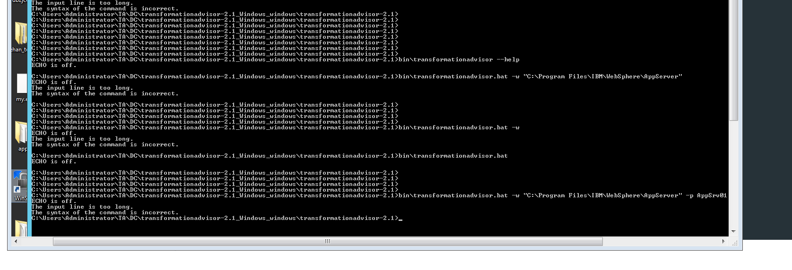
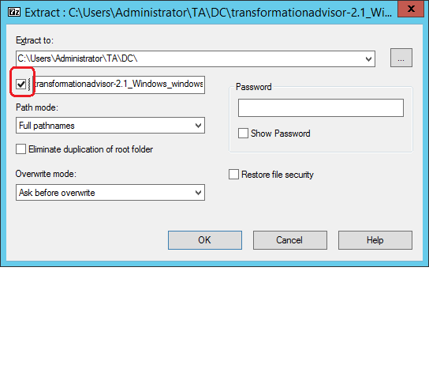

When I run the windows DC with command : 

bin\transformationadvisor.bat -w "C:\Program Files\IBM\WebSphere\AppServer" -p AppSrv01 admin admin

I see the output below ...

The issue is due to the TA_HOME path is too long. Suggested workaround is when you unzip the DC zip file, uncheck the 
option to use file name as sub dir as we already contain the transformationadvisor-2.1 sub directory in our zip file.

When this check box is unchecked, it will unzip to C:\Users\Administrator\TA\DC\transformationadvisor-2.1
